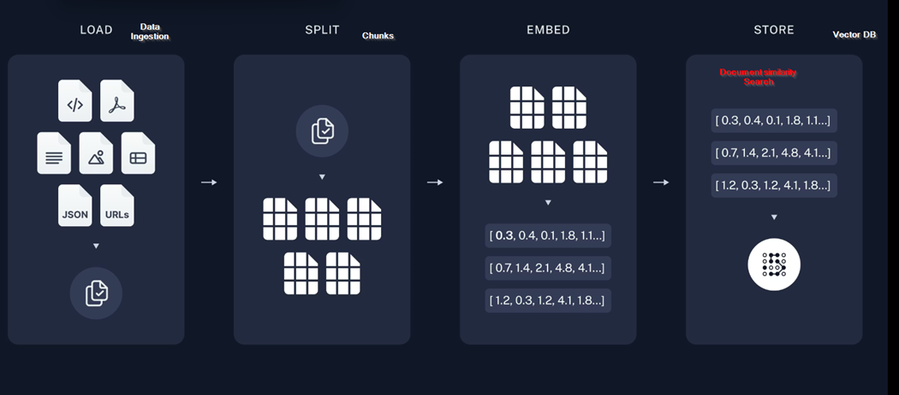
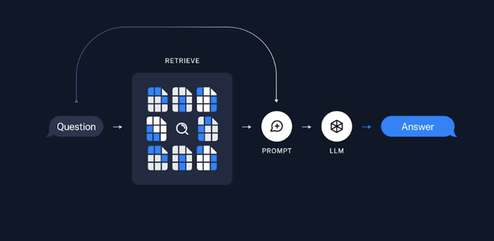

# RAG Pipeline 




This diagram illustrates a **RAG (Retrieval-Augmented Generation)** pipeline — the process of preparing documents so an AI can search and retrieve relevant information from them. It has 4 stages:

---

## 1. 📥 LOAD — *Data Ingestion*

Raw documents from various sources are ingested. These can include:

- Code files, PDFs, text docs, spreadsheets
- Images, JSON files, URLs

All of them get collected into a unified document set ready for processing.

---

## 2. ✂️ SPLIT — *Chunks*

The loaded documents are **broken into smaller pieces** called "chunks." This is necessary because:

- LLMs have a limited context window
- Smaller chunks = more precise retrieval later

---

## 3. 🔢 EMBED — *Embeddings*

Each chunk is converted into a **numerical vector** (e.g., `[0.3, 0.4, 0.1, 1.8, 1.1...]`) by an embedding model. These numbers capture the **semantic meaning** of the text, so similar concepts have similar vectors.

---

## 4. 🗄️ STORE — *Vector DB*

The vectors are stored in a **Vector Database**, which enables **Document Similarity Search** — finding the chunks most semantically relevant to a user's query at retrieval time.

---

## Why It Matters

This pipeline is the foundation of how AI systems (like chatbots or Q&A tools) can answer questions grounded in **your own documents**, rather than relying solely on training data.

| Stage  | Action             | Output          |
|--------|--------------------|-----------------|
| Load   | Ingest documents   | Raw docs        |
| Split  | Chunk documents    | Text chunks     |
| Embed  | Vectorize chunks   | Number arrays   |
| Store  | Save to Vector DB  | Searchable index|


# RAG Pipeline — Technical Deep Dive

This document explains the **RAG (Retrieval-Augmented Generation)** pipeline in detail — covering every stage, the tools available, and the technical decisions involved.

---

## 1. 📥 LOAD — *Data Ingestion*

The first step is loading raw data from various sources into a unified format (usually a `Document` object with `page_content` + `metadata`).

### 📄 Document Loaders

#### Text & Office Formats
| Loader | Library | Supported Formats |
|--------|---------|-------------------|
| `PyPDFLoader` | `langchain`, `pypdf` | `.pdf` |
| `UnstructuredWordDocumentLoader` | `unstructured` | `.docx`, `.doc` |
| `UnstructuredPowerPointLoader` | `unstructured` | `.pptx` |
| `CSVLoader` | `langchain` | `.csv` |
| `UnstructuredExcelLoader` | `unstructured` | `.xlsx`, `.xls` |
| `TextLoader` | `langchain` | `.txt`, `.md` |

#### Code & Structured Data
| Loader | Library | Supported Formats |
|--------|---------|-------------------|
| `JSONLoader` | `langchain` | `.json` (with jq path) |
| `PythonLoader` | `langchain` | `.py` |
| `NotebookLoader` | `langchain` | `.ipynb` |

#### Web & Online Sources
| Loader | Library | Source |
|--------|---------|--------|
| `WebBaseLoader` | `langchain` + `BeautifulSoup` | Any URL |
| `SeleniumURLLoader` | `selenium` | JS-rendered pages |
| `SitemapLoader` | `langchain` | XML sitemaps |
| `YoutubeLoader` | `langchain-community` | YouTube transcripts |
| `WikipediaLoader` | `langchain-community` | Wikipedia articles |
| `ArxivLoader` | `langchain-community` | Research papers |

#### Cloud & Database Sources
| Loader | Source |
|--------|--------|
| `S3FileLoader` | AWS S3 |
| `GCSFileLoader` | Google Cloud Storage |
| `NotionDBLoader` | Notion pages |
| `ConfluenceLoader` | Confluence wiki |
| `SlackDirectoryLoader` | Slack exports |

### Example (Python)
```python
from langchain.document_loaders import PyPDFLoader, WebBaseLoader

# Load PDF
loader = PyPDFLoader("document.pdf")
docs = loader.load()

# Load webpage
web_loader = WebBaseLoader("https://example.com")
web_docs = web_loader.load()
```

---

## 2. ✂️ SPLIT — *Text Chunking*

Documents are split into smaller chunks because:
- LLMs have limited context windows
- Smaller, focused chunks improve retrieval precision
- Reduces noise in the retrieved context

### Key Parameters
| Parameter | Description | Typical Value |
|-----------|-------------|---------------|
| `chunk_size` | Max characters per chunk | 500–2000 |
| `chunk_overlap` | Characters shared between chunks | 50–200 |
| `separators` | Where to split (newline, period, etc.) | `["\n\n", "\n", " "]` |

### 🔪 Splitter Types

#### 1. `RecursiveCharacterTextSplitter` *(Most Common)*
Splits by a priority list of separators. Tries `\n\n` first, then `\n`, then spaces.
```python
from langchain.text_splitter import RecursiveCharacterTextSplitter

splitter = RecursiveCharacterTextSplitter(
    chunk_size=1000,
    chunk_overlap=150,
    separators=["\n\n", "\n", ".", " ", ""]
)
chunks = splitter.split_documents(docs)
```

#### 2. `CharacterTextSplitter`
Simple split on a single character (e.g., `\n`). Fast but less smart.

#### 3. `TokenTextSplitter`
Splits by **token count** instead of characters — useful when feeding directly to a model with a token limit.
```python
from langchain.text_splitter import TokenTextSplitter
splitter = TokenTextSplitter(chunk_size=512, chunk_overlap=50)
```

#### 4. `MarkdownHeaderTextSplitter`
Splits Markdown files at header boundaries (`#`, `##`, `###`), preserving document structure.

#### 5. `HTMLHeaderTextSplitter`
Splits HTML by header tags (`<h1>`, `<h2>`, etc.).

#### 6. `CodeSplitter` / `Language` splitter
Language-aware splitting for code files (Python, JS, Go, etc.) using AST-aware boundaries.
```python
from langchain.text_splitter import Language, RecursiveCharacterTextSplitter
splitter = RecursiveCharacterTextSplitter.from_language(
    language=Language.PYTHON, chunk_size=500, chunk_overlap=50
)
```

#### 7. `SemanticChunker` *(Advanced)*
Uses embeddings to split at **semantic breakpoints** rather than fixed sizes — chunks are semantically coherent.
```python
from langchain_experimental.text_splitter import SemanticChunker
from langchain_openai import OpenAIEmbeddings

splitter = SemanticChunker(OpenAIEmbeddings(), breakpoint_threshold_type="percentile")
```

---

## 3. 🔢 EMBED — *Embeddings*

Each chunk is converted into a **dense vector** (array of floats) that captures semantic meaning. Similar text → similar vectors (measured by cosine similarity or dot product).

### 🧠 Embedding Models

#### Cloud / API-based
| Model | Provider | Dimensions | Notes |
|-------|----------|------------|-------|
| `text-embedding-3-small` | OpenAI | 1536 | Fast, cheap |
| `text-embedding-3-large` | OpenAI | 3072 | Higher accuracy |
| `text-embedding-ada-002` | OpenAI | 1536 | Legacy, still popular |
| `embed-english-v3.0` | Cohere | 1024 | Strong for English |
| `embed-multilingual-v3.0` | Cohere | 1024 | Multilingual |
| `embedding-001` | Google | 768 | Gemini family |
| `amazon.titan-embed-text-v1` | AWS Bedrock | 1536 | Enterprise |

#### Open Source / Local
| Model | Framework | Dimensions | Notes |
|-------|-----------|------------|-------|
| `all-MiniLM-L6-v2` | `sentence-transformers` | 384 | Lightweight, fast |
| `all-mpnet-base-v2` | `sentence-transformers` | 768 | Balanced quality |
| `bge-large-en-v1.5` | HuggingFace (BAAI) | 1024 | Top open-source |
| `e5-large-v2` | HuggingFace (Microsoft) | 1024 | Strong retrieval |
| `nomic-embed-text` | Nomic AI | 768 | Open, long context |
| `mxbai-embed-large-v1` | MixedBread | 1024 | High MTEB score |

### Example (Python)
```python
# OpenAI
from langchain_openai import OpenAIEmbeddings
embeddings = OpenAIEmbeddings(model="text-embedding-3-small")

# HuggingFace (local)
from langchain_huggingface import HuggingFaceEmbeddings
embeddings = HuggingFaceEmbeddings(model_name="BAAI/bge-large-en-v1.5")

# Generate a vector
vector = embeddings.embed_query("What is RAG?")
# → [0.3, 0.4, 0.1, 1.8, 1.1, ...]
```

### Similarity Metrics
| Metric | Use Case |
|--------|----------|
| **Cosine Similarity** | Most common; angle between vectors |
| **Dot Product** | Fast; works best with normalized vectors |
| **Euclidean Distance** | L2 distance; less common in NLP |

---

## 4. 🗄️ STORE — *Vector Databases*

Vector DBs store embeddings and enable fast **Approximate Nearest Neighbor (ANN)** search to find the most semantically similar chunks at query time.

### 🗃️ Vector Database Options

#### Cloud-Managed
| DB | Highlights | Best For |
|----|-----------|----------|
| **Pinecone** | Fully managed, fast, scalable | Production apps |
| **Weaviate Cloud** | Hybrid search, GraphQL API | Flexible schemas |
| **Qdrant Cloud** | Rust-based, fast filtering | High performance |
| **Zilliz (Milvus Cloud)** | Enterprise-grade Milvus | Large-scale |

#### Self-Hosted / Open Source
| DB | Highlights | Best For |
|----|-----------|----------|
| **Chroma** | Easy to use, in-memory or persistent | Prototyping |
| **FAISS** | Facebook's library, extremely fast | Research, local |
| **Milvus** | Distributed, production-grade | Scale |
| **Qdrant** | Filtering + vectors, Rust-based | Production |
| **Weaviate** | Multi-modal, hybrid search | Complex use cases |
| **Elasticsearch** | Vector + keyword (hybrid) | Existing ES users |
| **pgvector** | Postgres extension | SQL + vector unified |
| **Redis** | In-memory vector search | Low-latency apps |

#### Lightweight / Embedded
| DB | Highlights |
|----|-----------|
| **Chroma** (in-memory) | Zero setup, great for dev |
| **FAISS** | Pure library, no server needed |
| **LanceDB** | Serverless, columnar storage |
| **SQLite + sqlite-vss** | SQLite with vector support |

### Example (Python)
```python
# Chroma (local, easy)
from langchain_chroma import Chroma
vectorstore = Chroma.from_documents(chunks, embedding=embeddings, persist_directory="./db")

# Pinecone (cloud)
from langchain_pinecone import PineconeVectorStore
vectorstore = PineconeVectorStore.from_documents(chunks, embeddings, index_name="my-index")

# FAISS (in-memory)
from langchain_community.vectorstores import FAISS
vectorstore = FAISS.from_documents(chunks, embeddings)

# Similarity search
results = vectorstore.similarity_search("What is RAG?", k=5)
```

### Search Types
| Type | Description |
|------|-------------|
| **Similarity Search** | Top-k most similar vectors |
| **MMR (Max Marginal Relevance)** | Balances relevance + diversity |
| **Hybrid Search** | Combines vector + keyword (BM25) |
| **Filtered Search** | Vector search + metadata filters |

---

## 🔁 Full Pipeline Summary

| Stage | Tools / Libraries | Output |
|-------|-------------------|--------|
| **Load** | LangChain Loaders, Unstructured, BeautifulSoup | `Document[]` |
| **Split** | RecursiveCharacterTextSplitter, SemanticChunker | `Document[]` (chunks) |
| **Embed** | OpenAI, HuggingFace, Cohere, BAAI/bge | `float[]` vectors |
| **Store** | Chroma, Pinecone, FAISS, pgvector, Qdrant | Searchable Vector Index |

---

## 🧩 End-to-End Example

```python
from langchain.document_loaders import PyPDFLoader
from langchain.text_splitter import RecursiveCharacterTextSplitter
from langchain_openai import OpenAIEmbeddings
from langchain_chroma import Chroma

# 1. Load
loader = PyPDFLoader("my_doc.pdf")
docs = loader.load()

# 2. Split
splitter = RecursiveCharacterTextSplitter(chunk_size=1000, chunk_overlap=150)
chunks = splitter.split_documents(docs)

# 3. Embed + 4. Store
embeddings = OpenAIEmbeddings(model="text-embedding-3-small")
vectorstore = Chroma.from_documents(chunks, embeddings, persist_directory="./chroma_db")

# Query
results = vectorstore.similarity_search("Explain the main findings", k=3)
```

# 🧩 End-to-End Example — Pinecone + LangChain RAG

> Real-world pipeline to Load, Split, Embed, Store, and Query documents using **Pinecone** as the Vector Database.

---

## 📦 Install Dependencies

```bash
pip install langchain langchain-openai langchain-pinecone pinecone-client pypdf
```

---

## 🔑 Setup Environment Variables

```python
import os

os.environ["OPENAI_API_KEY"] = "your-openai-api-key"
os.environ["PINECONE_API_KEY"] = "your-pinecone-api-key"
os.environ["PINECONE_ENV"] = "your-pinecone-environment"  # e.g. "us-east-1"
```

---

## 🚀 Full Pipeline

```python
from langchain.document_loaders import PyPDFLoader
from langchain.text_splitter import RecursiveCharacterTextSplitter
from langchain_openai import OpenAIEmbeddings
from langchain_pinecone import PineconeVectorStore
from pinecone import Pinecone, ServerlessSpec

# ─────────────────────────────────────────
# 1. LOAD — Read the PDF document
# ─────────────────────────────────────────
loader = PyPDFLoader("my_doc.pdf")
docs = loader.load()
print(f" Loaded {len(docs)} pages")

# ─────────────────────────────────────────
# 2. SPLIT — Break into smaller chunks
# ─────────────────────────────────────────
splitter = RecursiveCharacterTextSplitter(
    chunk_size=1000,
    chunk_overlap=150
)
chunks = splitter.split_documents(docs)
print(f" Split into {len(chunks)} chunks")

# ─────────────────────────────────────────
# 3. EMBED — Convert text into vectors
# ─────────────────────────────────────────
embeddings = OpenAIEmbeddings(model="text-embedding-3-small")

# ─────────────────────────────────────────
# 4. PINECONE SETUP — Create Index
# ─────────────────────────────────────────
pc = Pinecone(api_key=os.environ["PINECONE_API_KEY"])

index_name = "langchain-rag-demo"

# Create index only if it doesn't exist
if index_name not in pc.list_indexes().names():
    pc.create_index(
        name=index_name,
        dimension=1536,           # text-embedding-3-small = 1536 dims
        metric="cosine",
        spec=ServerlessSpec(
            cloud="aws",
            region="us-east-1"    # change to your region
        )
    )
    print(f" Created Pinecone index: {index_name}")
else:
    print(f" Index already exists: {index_name}")

# ─────────────────────────────────────────
# 5. STORE — Upsert chunks into Pinecone
# ─────────────────────────────────────────
vectorstore = PineconeVectorStore.from_documents(
    documents=chunks,
    embedding=embeddings,
    index_name=index_name
)
print(" Documents stored in Pinecone!")

# ─────────────────────────────────────────
# 6. QUERY — Semantic Similarity Search
# ─────────────────────────────────────────
query = "Explain the main findings"
results = vectorstore.similarity_search(query, k=3)

print(f"\n Top {len(results)} Results for: '{query}'\n")
for i, doc in enumerate(results):
    print(f"--- Result {i+1} ---")
    print(f" Source : {doc.metadata.get('source', 'N/A')}")
    print(f" Page   : {doc.metadata.get('page', 'N/A')}")
    print(f" Content: {doc.page_content[:300]}...")
    print()
```

---

## 🔗 Load Existing Index (Skip Re-Uploading)

```python
# If documents are already stored, just connect to existing index
vectorstore = PineconeVectorStore.from_existing_index(
    index_name=index_name,
    embedding=embeddings
)
results = vectorstore.similarity_search("What are the key conclusions?", k=3)
```

---

## 🤖 Bonus — Use with LangChain RAG Chain

```python
from langchain_openai import ChatOpenAI
from langchain.chains import RetrievalQA

llm = ChatOpenAI(model="gpt-4o", temperature=0)

# Build RAG chain
qa_chain = RetrievalQA.from_chain_type(
    llm=llm,
    chain_type="stuff",
    retriever=vectorstore.as_retriever(search_kwargs={"k": 3}),
    return_source_documents=True
)

# Ask a question
response = qa_chain.invoke({"query": "Explain the main findings"})

print("🤖 Answer:\n", response["result"])
print("\n📚 Sources:")
for doc in response["source_documents"]:
    print(f"  - Page {doc.metadata.get('page')}: {doc.page_content[:200]}...")
```

---

## 🔁 Chroma vs Pinecone — Quick Comparison

| Feature | Chroma | Pinecone |
|---|---|---|
| **Type** | Local / Self-hosted | Fully managed cloud |
| **Setup** | No account needed | Requires API key |
| **Persistence** | Local directory | Cloud-native |
| **Scalability** | Limited | Highly scalable |
| **Best For** | Dev / Prototyping | Production apps |
| **Cost** | Free | Free tier + paid |
| **Speed** | Fast locally | Fast at scale |

---

## 🗺️ Pipeline Flow

```
PDF File
   │
   ▼
PyPDFLoader         ← Step 1: Load
   │
   ▼
RecursiveCharacterTextSplitter  ← Step 2: Split into chunks
   │
   ▼
OpenAIEmbeddings    ← Step 3: Convert text → vectors
   │
   ▼
Pinecone Index      ← Step 4: Store vectors in cloud
   │
   ▼
Similarity Search   ← Step 5: Query & retrieve top-k results
   │
   ▼
RetrievalQA Chain   ← Step 6: LLM generates final answer
```

---
> 💡 **Tip:** Use **Chroma** for local development and testing, then switch to **Pinecone** for production deployment with large-scale data.



# RAG (Retrieval-Augmented Generation) Architecture

This diagram explains how a **RAG (Retrieval-Augmented Generation)** system answers user questions using external knowledge instead of relying only on the LLM’s memory.

---

# 🔹 Simple Flow

```text
Question → Retrieve → Prompt → LLM → Answer
```

---

# 1️⃣ Question

The user asks a question.

Example:

```text
"What is the loan approval process?"
```

---

# 2️⃣ Retrieve

The system searches a **Vector Database** or knowledge base to find the most relevant document chunks related to the question.

Think of this like:

🔍 “Searching the company documents before answering.”

The retrieved chunks may come from:

- PDFs
- Policies
- Websites
- Databases
- Internal documents

---

# 🔹 What Happens Internally

The question is converted into an embedding vector.

Then the system performs:

## Similarity Search

It finds text chunks with similar meaning.

Example retrieved chunks:

```text
Chunk 1: Loan eligibility rules
Chunk 2: Credit score policy
Chunk 3: Approval workflow
```

---

# 3️⃣ Prompt

Now the system builds a prompt for the LLM.

The prompt contains:

```text
User Question
+
Retrieved Context
```

Example:

```text
Use the following information:

[Retrieved chunks]

Question:
What is the loan approval process?
```

---

# 4️⃣ LLM

The LLM (GPT, Claude, Llama, etc.) reads:

- The user question
- The retrieved documents

Then generates a grounded answer.

---

# 5️⃣ Answer

The final AI response is returned to the user.

Example:

```text
"The loan approval process includes income verification,
credit score evaluation, and underwriting review."
```

---

# 🔹 Why This Architecture Is Powerful

Without retrieval:

```text
LLM guesses from training data
```

With RAG:

```text
LLM answers using real company data
```

This reduces:

- Hallucination
- Wrong answers
- Outdated information

---

# 🔹 Simple Real-Life Analogy

Imagine a student in an exam.

## Without RAG

Student answers from memory only.

❌ May forget or guess.

---

## With RAG

Student first opens textbook notes,
finds relevant section,
then answers.

✅ More accurate answer.

---

# 🔹 Technical Meaning of Each Block

| Block | Meaning |
|---|---|
| Question | User query |
| Retrieve | Search relevant chunks |
| Prompt | Combine question + context |
| LLM | Generate intelligent response |
| Answer | Final grounded output |

---

# 🔹 Key Idea

The LLM is NOT storing all enterprise knowledge internally.

Instead:

```text
Knowledge stays in Vector DB
```

The system dynamically retrieves relevant information during runtime.

---

# 🔹 Example Technologies

| Step | Technologies |
|---|---|
| Retrieve | Pinecone, FAISS, ChromaDB |
| Prompt | LangChain PromptTemplate |
| LLM | GPT-4, Claude, Llama |
| Embeddings | OpenAI, HuggingFace |

---

# 🔹 End-to-End Example

```text
User asks question
        ↓
Convert question to embedding
        ↓
Search vector database
        ↓
Retrieve relevant chunks
        ↓
Build prompt
        ↓
Send to LLM
        ↓
Generate accurate answer
```

---

# 🔥 Core Concept

RAG makes LLMs:

- More accurate
- More reliable
- More enterprise-ready
- Less hallucinated
- Able to answer from private data

This is the foundation of modern AI chatbots and AI assistants.
